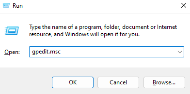
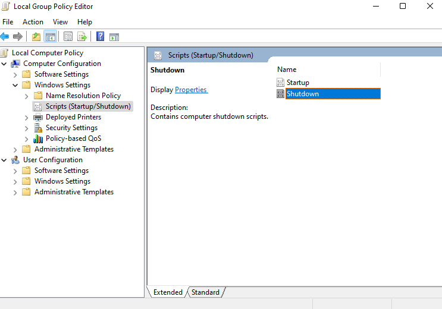
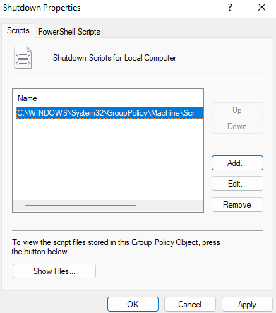

If the computer you want to install the Keylogger on has a data restore service after a system restart or shutdown, the original script will not work.

For this, I have created two scripts that send the data whenever the system is shut down.

# WithScript

The WithScript version captures the data and saves it in a specific folder on the system. When Windows enters shutdown mode, it goes to this folder and runs the selected scripts. Don't forget that all scripts must be EXE files compiled by Pyinstaller

To add the script to be run at shutdown, do the following:

1. Use Win + R, type <code style="background-color: rgb(53, 53, 53); color: aliceblue;">gpedit.msc</code> and press enter

    

2. Go to Computer Configuration --> Windows Settings --> Scripts (Startup/Shutdown) --> Shutdown and open properties

    

3. In the properties screen add the script with the name being the path from where it is. Remember that the script and the log file must be inside <code style="background-color: rgb(53, 53, 53); color: aliceblue;">C:\Windows\System32\GroupPolicy\Machine\Scripts\Shutdown\\</code>. Then hit apply

    

Now just set the Keylogger to run at system startup

# WithService

The WithService version adds a Windows service that keeps receiving Keylogger information and storing it in a variable, until the system is shut down/restarted

The difference with WithScript is that the service runs in parallel with the Keylogger receiving data and automatically detects when the system is about to shut down without making use of a log file

To add the service, do the following:

1. Open CMD as an administrator and type <code style="background-color: rgb(53, 53, 53); color: aliceblue;">sc create "YourServiceName" binpath= "YourServicePath"</code> where YourServiceName can be a name of your choice and YourServicePath is somewhere inside the Windows folder

2. Type this last command to configure the service to start up together with the system <code style="background-color: rgb(53, 53, 53); color: aliceblue;">sc config YourServiceName start= auto</code>

Now just set the Keylogger to run at system startup

Note that the script for sending the log is now a service, that's because the Keylogger unfortunately cannot capture keystrokes by starting as a service