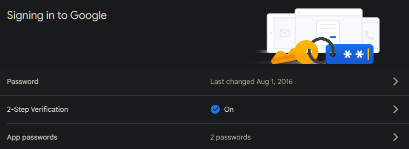
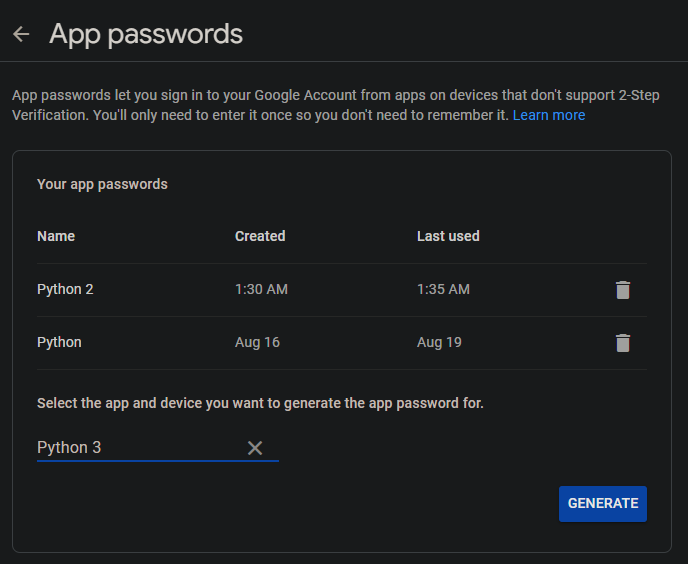
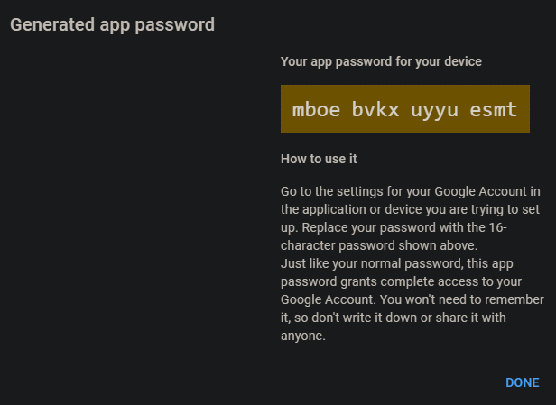

This script is just a challenge for me to create something from scratch using only Python

It uses some libs listed below:

- Pynput - to capture what is being digited
- Datetime - to check the last date that the script has - sent the log file and compare it with the current date
- Linecache - to get any line from a text file
- Smtplib - to send the email<
- Pyautogui - to get the active window name
- And Sys - to increase the recursion limit of the script
  
It's importante to note that this script uses Pyinstaller to compile the software allowing him to run on Windows as a .EXE file

## How to use
First, you need to check if you have all the libs and dependencies installed using pip.

Change the necessary time to send the log in line 27. The default is 7 days, if it pass that stipulated time then the script will send the email and restart the log file.

Then you can start changing "check_file" and "log_file" to something like:

- check.dll and log.dll
- config.ini and data.log
- If you wanna hide your files, then at least change their names

With that, we can generate the credentials for the SMTP server using Google Gmail

Keep in mind that Google SMTP server only works if you have the 2-Step Verification enabled and a generated password for your app. You can use other SMTP servers to send the log to your email, but in this casez we will use Google SMTP

In order to do that you will need to:

1. Enable 2-Step Verification in Security
    
2. Generate a password under the option App passwords, with the name of your application. For example, you can put Python or something like that
    
    
3. Grab that password and put it with your email in the script

Finally, whe can compile our script using Pyinstaller with: <code style="background-color: rgb(53, 53, 53); color: aliceblue;">pyinstaller -w --onefile Key.py</code>

It will generate a .EXE file that can be saved in any folder with the check and log files with it

In order for the program to work at Windows startup, it's important to create a link under <code style="background-color: rgb(53, 53, 53); color: aliceblue;"> C:\Users\%USERNAME%\AppData\Roaming\Microsoft\Windows\Start Menu\Programs\Startup</code> for local users and <code style="background-color: rgb(53, 53, 53); color: aliceblue;">C:\ProgramData\Microsoft\Windows\Start Menu\Programs\Startup</code> for all users

## Last words

You can easily check that this program isn't that secure. There's no check if the necessary files exist or ways to hide your email and password if someone decompiles your program.

Using a function under the same function creates a recursion in the script, and that can lead to memory overflow. As you can see, this occurs on line 102, so I increased the limit of a possible recursion, since when the computer restarts, the script's memory is cleaned.

THIS PROJECT IS FOR EDUCATIONAL PURPOSES ONLY, SO DO NOT TRY TO HARM PEOPLE USING IT
